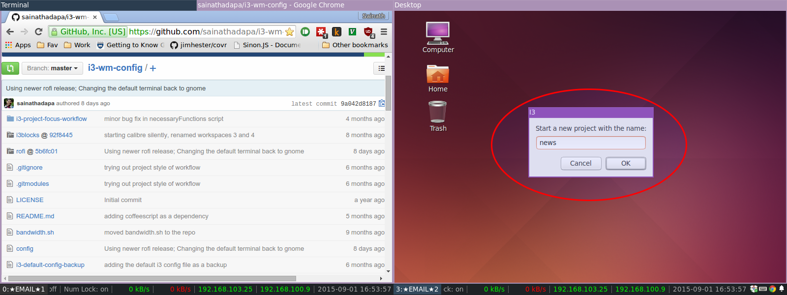
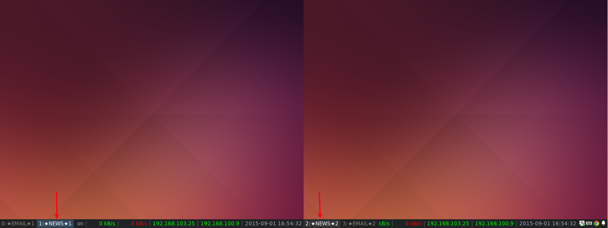
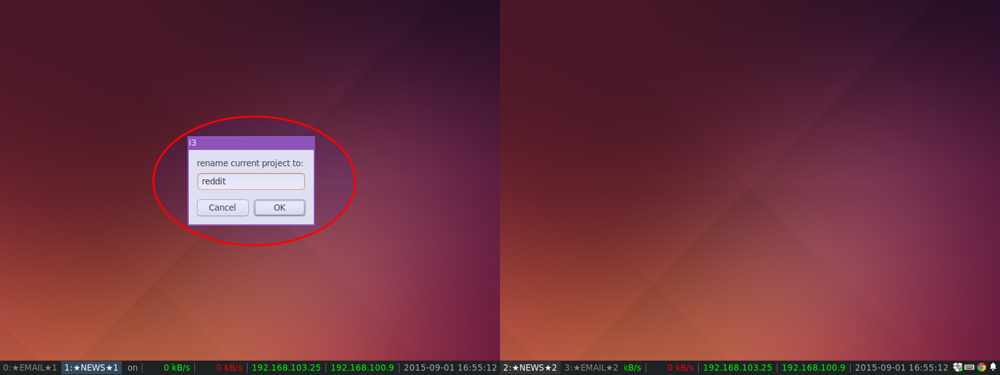
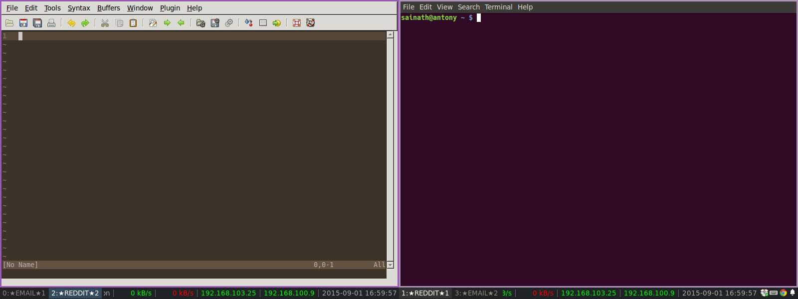
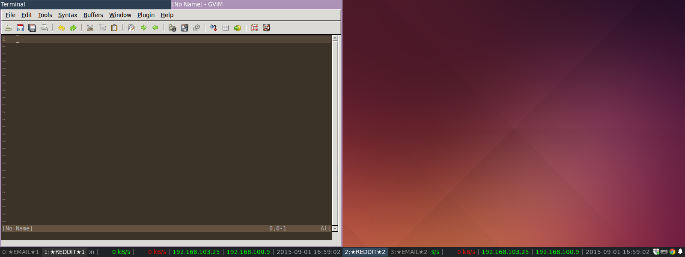

# Install
- Install NodeJS, NPM and Coffeescript (`apt-get install nodejs npm coffeescript`)
- `cd .i3/i3-project-focus-workflow/; npm install`
- Bind the scripts to shortcut keys in the I3 config file

You can also directly install from [npm](https://www.npmjs.com/package/i3-project-focus-workflow).
`npm install i3-project-focus-workflow`

# Usage
- A project is defined as a set of workspaces, one workspace for each display/monitor available.
- To create a new project, run `newProjectWorkspaces.coffee` script. This will display a dialog box asking for the project name. Names of the workspaces will contain the project name.

Dialog box:

After:

- To rename a project, run `renameProject.coffee`. This will display a dialog box asking for the new project name.

Dialog box:

After:

- To switch to the next project, run `switchNextProject.coffee`
- To cycle the focus between the workspaces in a project, run `cycleProjectWorkspacesFocus.coffee`
- To shift all the workspaces in a project to each one's respective next display, run `cycleProjectWorkspacesOutput.coffee`. For example, if the initial state of the workspaces is {Wksp 1 - Disp 1}, {Wksp 2 - Disp 2}, {Wksp 3 - Disp 3}, after running the script, the final state will be {Wksp 1 - Disp 2}, {Wksp 2 - Disp 3}, {Wksp 3 - Disp 1}.

Initial state:

After running the script:

- To switch the focused container to the next workspace in the project, run `cycleContainerProjectWorkspaces.coffee`.

Initial state:

After running the script:

